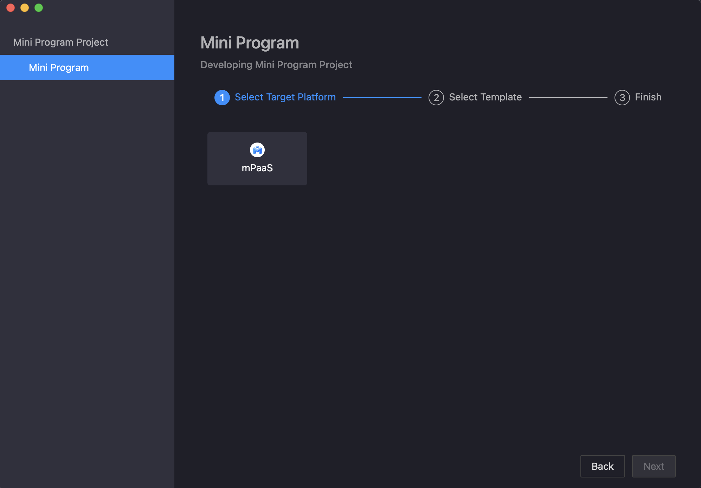
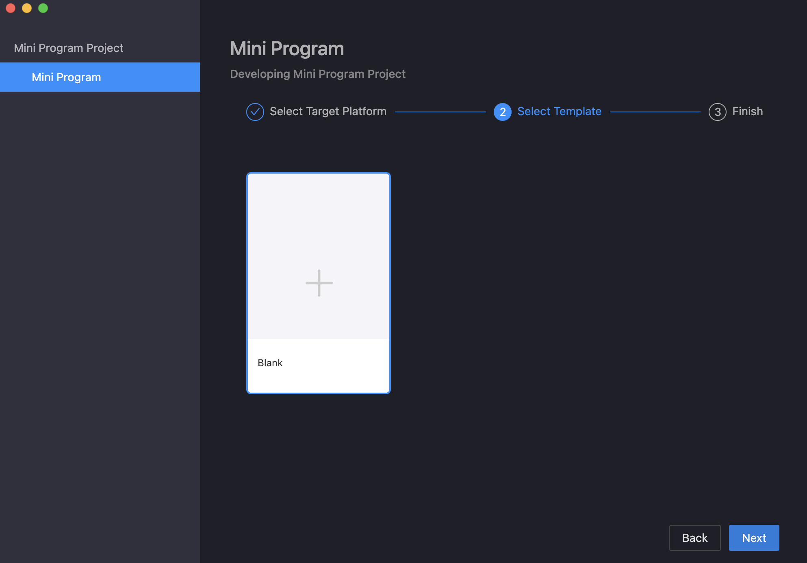
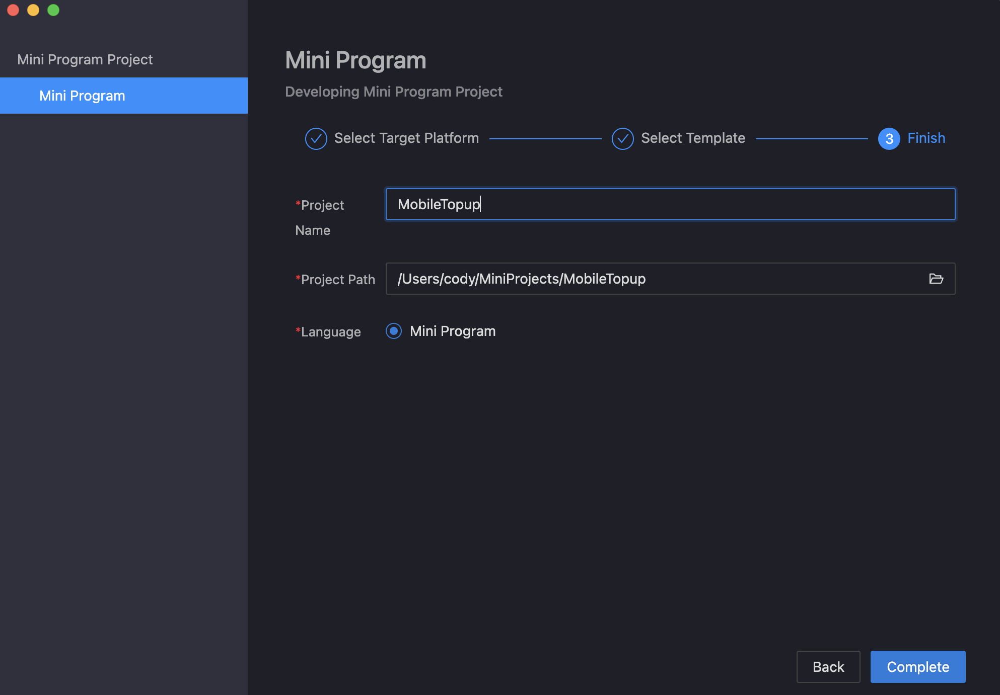
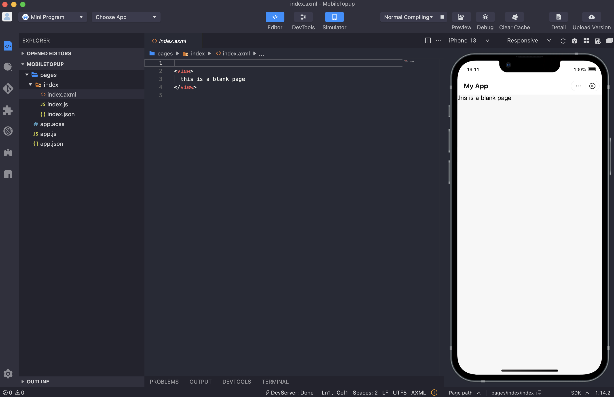
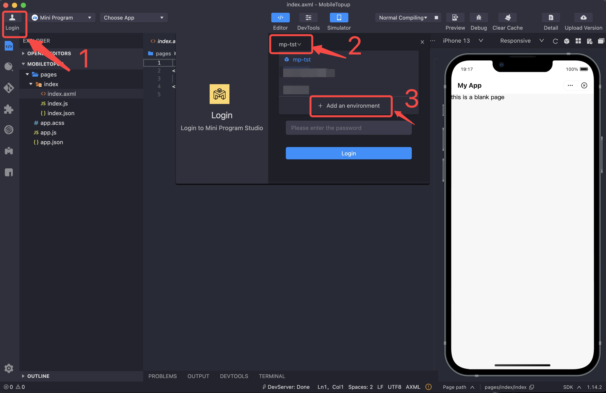
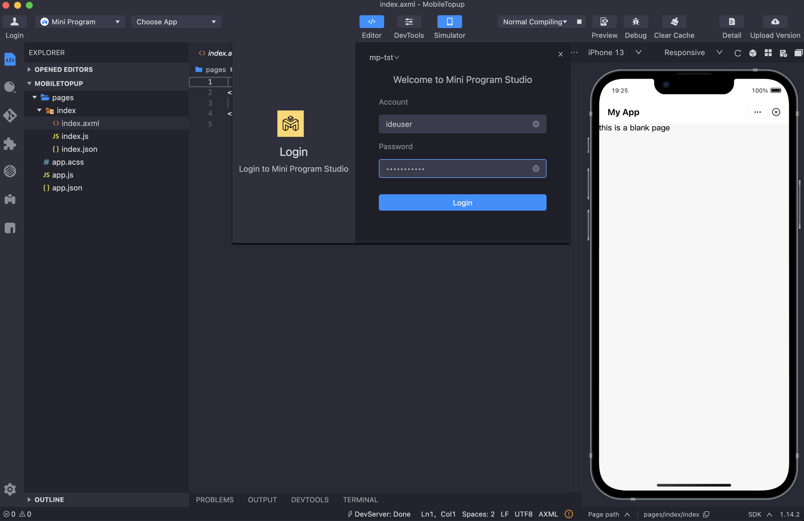
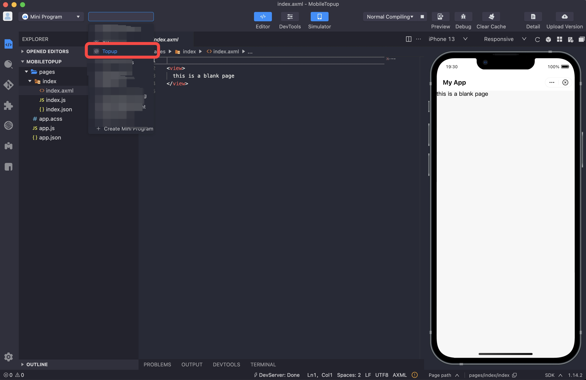
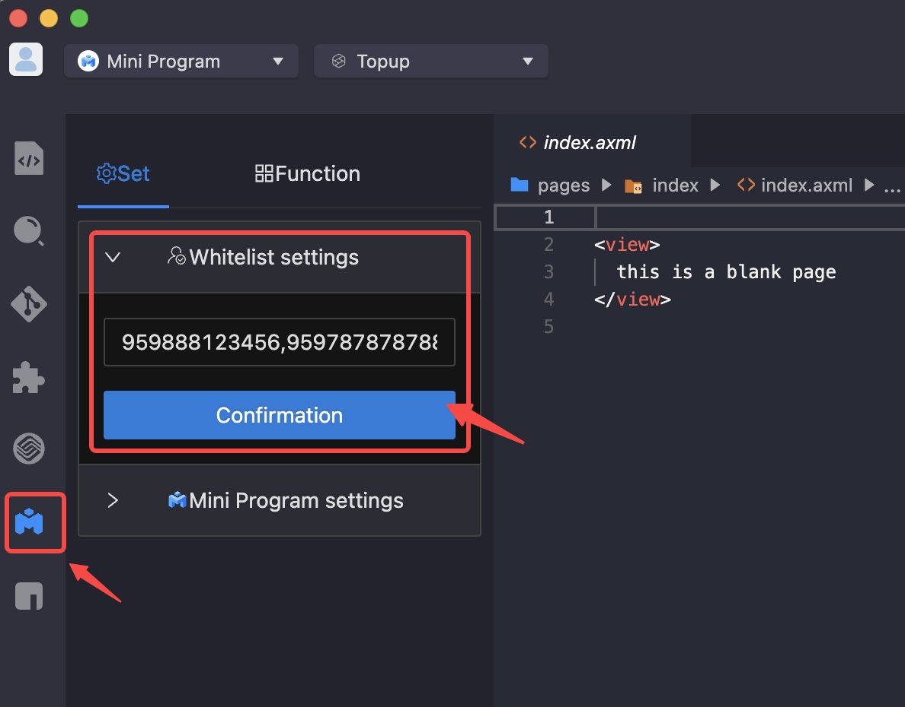
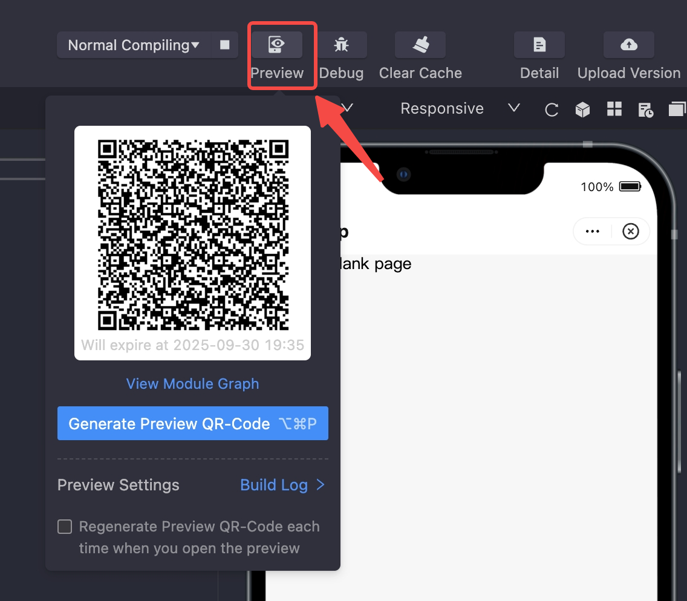
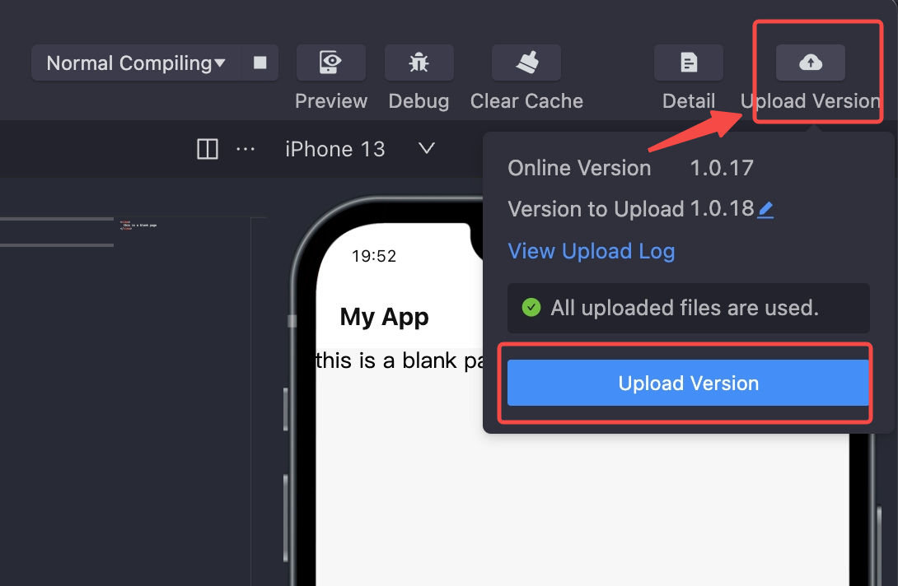

# Mini App IDE
##  Install IDE
Clike links below to install mini app IDE:  

[Windows](https://static.getmya.io/pub/miniapp/ide/MiniProgramStudio-3.8.3-dev.1035-x64.exe)  

[MacOS (Apple)](https://static.getmya.io/pub/miniapp/ide/MiniProgramStudio-3.8.3-dev.1034-arm64.dmg)   

[MacOS (Intel)](https://static.getmya.io/pub/miniapp/ide/MiniProgramStudio-3.8.3-dev.1033-x64.dmg)  

##  Create your first mini app project

Select target platform:



Select project template:



Type in project name and choose project path:



Your first blank project:



IDE load new config file:



Click [here](https://static.getmya.io/pub/miniapp/ide/mini-ide-config-uat.json) to download config file.

Input IDE login username and password (ask City to provide):



Select mini app which is created on Open Platform:



Before you can preview the mini app on your phone, you must set your username (your phone number registered on City Super App with format 959xxxxxx) in whitelist first.



Click `Confirmation` after you've set your whitelist. You can set multiple usernames in whitelist by using comma as separator.

After finishing project, you can preview your mini app on your phone by generating a preview QR code as follows:



You can now use City Super App to scan above QR code to preview it on your phone.

After you are satisfied with your preview, you can then proceed to submit a new version for Open Platform to review.



##  Write mini app code

Here are some of the useful online documentation on how to write your first mini program.

[Understand the Mini Program File Structure](https://miniprogram.alipay.com/docs/miniprogram/mpdev/quick-start_understand-the-mini-program-file-structure)

[Learn to Write a Todo App Demo](https://miniprogram.alipay.com/docs/miniprogram/mpdev/quick-start_learn-more-about-todo-app-demo)

We can call a series of JSAPIs provided by mPaaS or customized JSAPIs to access native capabilities. 

For example, we can do network requests in mini programs by calling JSAPI `my.request`: 

```js
my.request({
  url: 'https://httpbin.org/post',
  method: 'POST',
  data: {
    from: 'Mini Program',
    production: 'JSAPI',
  },
  dataType: 'json',
  success: function(res) {
    my.alert({content: 'success'});
  },
  fail: function(res) {
    my.alert({content: 'fail'});
  },
  complete: function(res) {
    my.hideLoading();
    my.alert({content: 'complete'});
  }
});

const task = my.request({url: 'https://httpbin.org/post'})
task.abort()
```

Here is a description of each property for the above JSAPI:

| Property     | Type     | Required | Description                                                  |
| ------------ | -------- | -------- | ------------------------------------------------------------ |
| url          | String   | Yes      | Target server url.                                           |
| headers      | Object   | No       | Set the request HTTP header. The default value is {'content-type': 'application/json'}. |
| method       | String   | No       | The default value is GET. Both GET and POST are supported.   |
| data         | Object   | No       | Request parameter.                                           |
| timeout      | Number   | No       | Timeout period in ms. The default value is 30000.            |
| dataType     | String   | No       | Expected format of the returned data. The following formats are supported:jsontextbase64The default format is JSON. If an exception occurs, it may not be JSON in the callback. |
| enableCookie | Boolean  | No       | Indicates whether the cookie request header is used. Valid values are:true: indicates the cookie request header is used.false: indicates the cookie request header is ignored and any available and non-expired cookies that are returned by the server in the previous response are automatically used. |
| success      | Function | No       | The callback function for a successful API call.             |
| fail         | Function | No       | The callback function for a failed API call.                 |
| complete     | Function | No       | The callback function used when the API call is completed. This function is always executed no matter the call succeeds or fails. |

We can also start scanning from mini program by simply calling `my.scan`:

```js
my.scan({
  type: 'qr',
  success: (res) => {
    my.alert({ title: res.code });
  },
});
```

For the full list of JSAPIs, we can check this link: [JSAPI Reference](https://miniprogram.alipay.com/docs/miniprogram/mpdev/api_api-reference).

