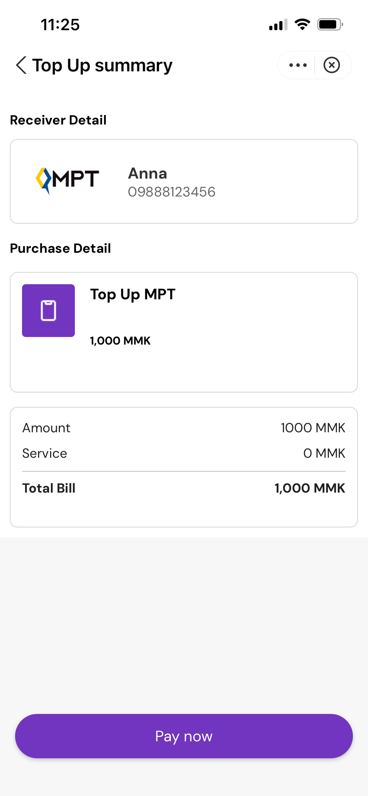
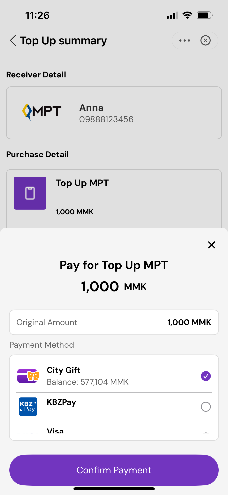
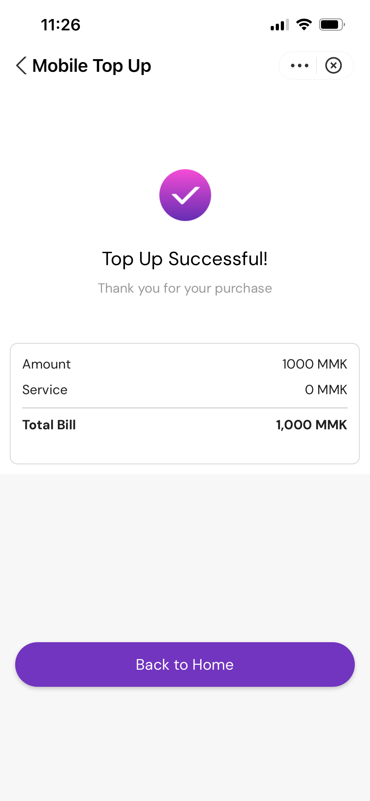
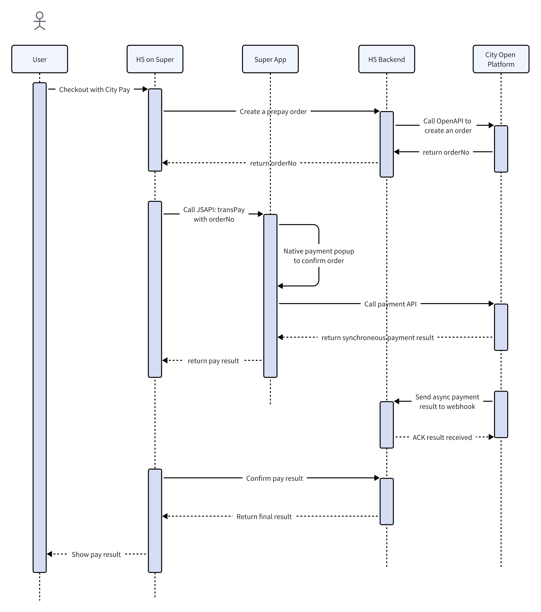

# Payment Integration

Below is a typical payment flow in a mini app or H5:

| Order confirmation | Paying | Payment completed |
|---------|---------|---------|
|  |  |  |

The folowing diagram shows the payment integration process:




## Signature Machanism

Before introducing payment related Open APIs, we need to talk about how to generate a sign value, in order to securely validate the traffic between the two parties.

RSA key pairs are used to generate and validate signatures. The algorithm used to generate signatures is `SHA256withRSA`.

2 key pairs are used in payment related APIs to ensure secure two-way communication:

1. merchant generated key pair, with which merchant will use the private key to generate `sign` value for data sending to Open platform, while Open platform will use the corresponding public key to verify that sign value.
2. platform generated key pair, with which platform will use the private key to generate `sign` for data sending to merchant backend, while merchant will use the public key to verify that sign value.

### Signature Generation

1. Collect all the parameters to be signed into a `Map<String, String>`.
2. Exclude any parameter with an empty or null value.
3. Sort the remaining parameters **by ASCII dictionary order of their keys**.
4. Concatenate the parameters into a single string using the format: `key1=value1&key2=value2&...&keyN=valueN`
5. Use RSA with SHA256 (`SHA256withRSA`) and your **private key** to sign this concatenated string.
6. Base64-encode the resulting signature and send it as the `sign` parameter in your request.

### Signature Verification

1. Collect all parameters received, **excluding the** **`sign`** **parameter**.
2. Filter out any parameters that are empty or null.
3. Sort the remaining parameters in ASCII dictionary order.
4. Concatenate the parameters using the same `key=value` format as during signing.
5. Use RSA with SHA256 (`SHA256withRSA`) and the **public key** to verify the Base64-decoded `sign` value against the concatenated parameter string.
6. If verification succeeds, the signature is valid and the request is considered authentic.

### Java Code Example

```java
package city.cn.base.utils;

public class SignatureUtil {

    public static String generateRsaSignature(Map<String, String> params, String privateKeyBase64) {
        try {
            String baseString = generateParamStr(params);

            byte[] privateKeyBytes = Base64.getDecoder().decode(privateKeyBase64);
            PKCS8EncodedKeySpec keySpec = new PKCS8EncodedKeySpec(privateKeyBytes);
            KeyFactory keyFactory = KeyFactory.getInstance("RSA");
            PrivateKey privateKey = keyFactory.generatePrivate(keySpec);
            Signature signature = Signature.getInstance("SHA256withRSA");
            signature.initSign(privateKey);
            signature.update(baseString.getBytes());
            byte[] signedData = signature.sign();
            return Base64.getEncoder().encodeToString(signedData);
        } catch (Exception e) {
            throw new RuntimeException("Signature generation failed", e);
        }
    }

    public static boolean verifyRsaSignature(Map<String,String> params, String signedData, String publicKeyBase64) throws Exception {
        byte[] publicKeyBytes = Base64.getDecoder().decode(publicKeyBase64);
        X509EncodedKeySpec keySpec = new X509EncodedKeySpec(publicKeyBytes);
        KeyFactory keyFactory = KeyFactory.getInstance("RSA");
        PublicKey publicKey = keyFactory.generatePublic(keySpec);

        Signature signature = Signature.getInstance("SHA256withRSA");
        signature.initVerify(publicKey);
        String paramStr = generateParamStr(params);
        signature.update(paramStr.getBytes());
        return signature.verify(Base64.getDecoder().decode(signedData));
    }

    public static String generateParamStr(Map<String, String> params) {
        Map<String, String> sortedParams = new TreeMap<>(params);
        StringBuilder baseString = new StringBuilder();
        // Concatenate params key1=value1&key2=value2&...
        Set<Map.Entry<String, String>> entrySet = sortedParams.entrySet();
        for (Map.Entry<String, String> entry : entrySet) {
            if (StringUtil.isNotEmpty(entry.getValue())) {
                if (baseString.length() > 0) {
                    baseString.append("&");
                }
                baseString.append(entry.getKey()).append("=").append(entry.getValue());
            }
        }
        return baseString.toString();
    }
}
public class RsaSignExample {

    private static String privateKey = "MIIEugIBADANBgkqhkiG9w0BAQEFAASCBKQwggSgAgEAAoIBAQDQcLi01myHWAlDxZjdBvqcMORMonQt6DyPDS/CiLQhs1PfWGUOa53+SLWcmDycz9KPm6owDBOxfk+OMuQaMkSBb8Z1AUfi1bwxlvtJnL1tntDYCN5RYj7uJB6IPEXvGNctKjadlCRtXWstSh8QToiZ3OdzeITfcv9tnnDXbPxdLiJAY/D/rnza/OsjKJ7Os7xfpcnz+ozTJE86q7F2Bf9a7bX6op3my+3gANjOapaymPo42ltplFJm9VLz80D9zUowDM1GC3OA8oEcR3EfUBmIMcE7xBZB64CJQ1/kWf0Yp6tbRqThcrKISIAwuodqJxOUBuEJpYxvlGKmQQzwz5+3AgMBAAECgf9J1EH177xHhxm5xxvjWUKLhzkqy03Zk3q/TXHPtqp0tSWl7zX5Bg+kbf+6kOXyBnugYi/BtIViCbHb9+KENf4jdbTHLIyDfKgoZqTxp525GWAHbUDIpM3QusC7pJ2w8jvyL5j9dOtG44fVjajGAQPm1eu1X68ZQ+pkLe0V0KUJtazY/KGk94rRL9/94uSUPwBOeQyhQoYy1eJr/BcCs8SFhffV9rf3QFokB68x1bnuipYDojW+FJFRh3u1daXw1MbUeVv/ppjuY/SwerHEvvMXeMfgqKYxDka2lFKjOW+18XibiOnDJ+KnKdA6osPIJ7MFX5ATIq0pYs7RRzFngpECgYEA032CNJFc/c0FHCKcTmC1Bjd2R39lj6Dp6wUkMOhve/wwDxb3xFp7SQxqMXZd5rrNPO4G3RqDxzV2jZJW4QzIcIXe2OND5gWaCIZ/XRxR5S8YQ7Hir5foknuQXnqEB4LvmsZe/pR42mNsBQayMmOY8gN44vtY53Wkwq4zOI83fosCgYEA/E7j7DHRck2tuRCSKsWFQ78uyIHxzNx5x30n0Sr2xYB5YvPspQUfeQ2E74Ruc4yhzEQAv4iJ+1rQkYh2bRYoM+5h6I28U5zSRMkzWe7IUy+rOi+wCcKz6Q8uNjQpGHtlrXIsmfhSoz28OmT3h4ofJMQAxeCCHRlpd8opjiPiVQUCgYBS+uHFomtsIa8plOLjVcpxP/2mm/PLYQWm8wN6NRjY+uAYa5iXcDEDPl3EPn8lcpHooDQNOMQPu4hij9KKxqs2izAexTz02anQQoVikSQI2muY1AjvgJj+MIE6sLNxBwzgG4lWNgcdGPlfF3t/jdiKzJX36Uq+tkgJIrRyMq9BdQKBgHUARHOIWp8N5IyYYZ/R/s1+v7wdfjrI1vQqVqeJq+vEewXnJYsUyBaDrWzA1dNhmLo3or0vHQVhhKyoQnqttrD2T5Le/0EqzNs3DkgbEex5g4a1DIZKMtHVx1E9eP0wY+M9ue8gl3m5rCrMHXlOFMkg11brmIrT+POi3QhcHZ3dAoGAUMiVG3W4ZkevgrK00RDIsbXbbnAJ8AgroI2g51DI7TM0v9QphewXClHMFw+s7lsj9r9+YEWqfEEG7nwvKH9jpaDkBLcd118XQmYWEB+fBQhSNrPczh0VXItBVBCIFtCxYLPUu5JS0fMl19xFzBKO0XOf+WsxgS00ZK7njbjMoRc=";

    private static String publicKey = "MIIBIjANBgkqhkiG9w0BAQEFAAOCAQ8AMIIBCgKCAQEA0HC4tNZsh1gJQ8WY3Qb6nDDkTKJ0Leg8jw0vwoi0IbNT31hlDmud/ki1nJg8nM/Sj5uqMAwTsX5PjjLkGjJEgW/GdQFH4tW8MZb7SZy9bZ7Q2AjeUWI+7iQeiDxF7xjXLSo2nZQkbV1rLUofEE6Imdznc3iE33L/bZ5w12z8XS4iQGPw/6582vzrIyiezrO8X6XJ8/qM0yRPOquxdgX/Wu21+qKd5svt4ADYzmqWspj6ONpbaZRSZvVS8/NA/c1KMAzNRgtzgPKBHEdxH1AZiDHBO8QWQeuAiUNf5Fn9GKerW0ak4XKyiEiAMLqHaicTlAbhCaWMb5RipkEM8M+ftwIDAQAB";

    public static void main(String[] args) throws Exception {
        // Data to be signed
        Map<String,String> params = Maps.newHashMap();
        params.put("version","1.0.0");
        params.put("timestamp","1734070811135");
        params.put("nonceStr","00673942f8e44774a81f3a28fd14a93a");
        params.put("miniAppId", "100000010008");
        params.put("merchantCode", "20001");
        params.put("merchOrderNo", "P1000000000000001");
        params.put("title", "test");
        params.put("totalAmount", "100");
        params.put("transCurrency", "MMK");
        params.put("timeoutExpress", "100m");
        params.put("callbackInfo", "title%3diphonex");
        params.put("businessParam", "title%3diphonex");
        params.put("creditUnit", "Cash");
        params.put("availablePayChannels", "walletPayment,kbzPayment,bankCardPayment");
        params.put("capture", "true");

        // Sign request
        String sign = SignatureUtil.generateRsaSignature(params, privateKey);
        log.info("============sign:{}",sign);
        // Verify request
        var verifyResult = SignatureUtil.verifyRsaSignature(params,sign,publicKey);
        log.info("============verifyResult:{}",verifyResult);
    }

}
```

## Merchant Creates a Prepay Order

After getting access token, merchant backend can call Open API: `Create Prepay Order` before launching payment on mini app through JSAPI.

Refer to [Open API Doc](https://static.getmya.io/apidoc/SuperOpenAPI.html) for more details.

## Merchant Mini App JSAPI

After creating the above prepay order, a mini app can then launch the native payment module by calling the following JSAPI:

```js
my.call('transPay', {
  "transNo": '1867458000412323840' // paymentOrderNo returned from prepay order OpenAPI
}, function (result) {
  // check payment result synchronously
  if (result.resultCode == 1000) {
      // synchronous payment result: success
  }
  else {
      // failed
  }
});
```

## Payment Status Webhook

The above JSAPI call will return payment result synchronously. But for more secure and reliable payment results, the merchant side is recommended to implement a webhook to receive payment result asynchronously, which will be called by the Open Platform to notify payment status changes. 

Merchant backend needs to create an endpoint with `POST` method that expects the following `JSON` body in the API request:

```json
{
  "merchantOrderNo": "P1000000000000001",  // Merchant order ID
  "paymentOrderNo": "MM202310100001",   
  "totalAmount": 100.00,   // Transaction amount
  "callbackInfo": "item%3diphonex",  // Same value set in prepayment order
  "transEndTime": 1696944610000,  // Unic timestamp in milliseconds
  "tradeStatus": "SUCCESS",  // All available status: PENDING, AUTHRORIZED, SUCCESS, FAILED, CANCEL.  
  "transCurrency": "MMK",
  "sign": "wiEzRw8aL89BuITsLLmM+RfT29oqM5A6cApZoyfdIRtugwaoFkK9BcrzPanCLfCN6GoMtSlsAc93j9YuO58kovs6uscwfe8W0iaWOvnRrF0KSgWxV4YbclcMoZBcqf6/dSrvh12CfYXF+L1e+eSdA/hhqyFYWieCDS/bO8qeucE+QSf3QYk0cK32OCn2k+kK/XL669aurKocKRCyNm06XrCxJnZUbnVaue0FmI3RKdA1bXbycEF6g8pR/920ASAhlZebpeX5Ip6N0lwFAV+yRemi1YjPW17LdvYq7bYb5obQrI25V5vR7u9zJHG9pzOXmTKZA1a/nwu3fqnYK6KMdg==",
  "notifyTime": 1696944610000,    // Unic timestamp in milliseconds
  "nonceStr": "randomString123",
  "paymentMethod":"WALLET"   // Customer selected payment method: WALLET, KBZ or BANK_CARD
}
```

Upon receiving the above request body, merchant backend must verify `sign` value with the above mentioned `Signature Verification` method to prevent any fraudulent request.

!>  After implementation of the above endpoint on merchant backend, please provide this webhook URL to City Super side for configuration before you can receive payment status asynchronously.